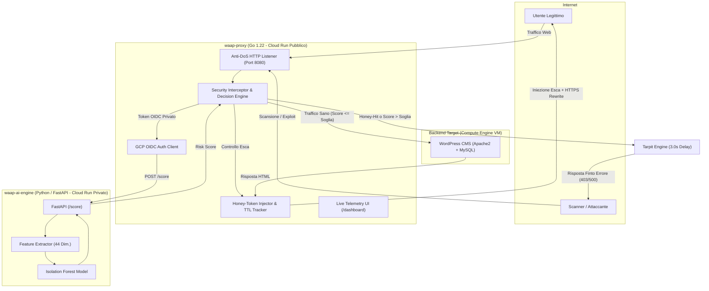

# Cyber Deception WAAP

> **Web Application and API Protection (WAAP) integrato con Cyber Deception dinamica e rilevamento anomalie tramite Machine Learning non supervisionato (Isolation Forest).**

[](https://golang.org/)
[](https://www.python.org/)
[](https://fastapi.tiangolo.com/)
[](https://scikit-learn.org/)
[](https://www.docker.com/)
[](https://cloud.google.com/run)
[](#)

---

## Indice

1. [Panoramica e Obiettivi del Progetto](#panoramica-e-obiettivi-del-progetto)
2. [Architettura del Sistema](#architettura-del-sistema)
3. [Funzionalità Chiave](#funzionalità-chiave)
4. [Struttura della Repository](#struttura-della-repository)
5. [Pipeline di Machine Learning (AI Engine)](#pipeline-di-machine-learning-ai-engine)
6. [Risultati Sperimentali e Benchmark](#risultati-sperimentali-e-benchmark)
7. [Installazione e Guida all'Avvio Rapido](#installazione-e-guida-allavvio-rapido)
   - [Modalità 1: Docker Compose (Consigliata)](#modalità-1-docker-compose-consigliata)
   - [Modalità 2: Esecuzione Manuale dei Microservizi](#modalità-2-esecuzione-manuale-dei-microservizi)
8. [Testing e Simulazione di Traffico](#testing-e-simulazione-di-traffico)
9. [Deployment su Google Cloud Platform (Cloud Run)](#deployment-su-google-cloud-platform-cloud-run)
10. [Contesto Accademico e Crediti](#contesto-accademico-e-crediti)

---

## Panoramica e Obiettivi del Progetto

I Web Application Firewall (WAF) tradizionali basati su regole deterministiche e firme statiche (es. OWASP Core Rule Set) presentano due limiti strutturali:
1. **Inefficacia contro minacce Zero-Day e payload offuscati**: una firma statica non può intercettare pattern non noti o varianti modificate tramite tecniche di evasione WAF.
2. **Asimmetria a favore dell'attaccante**: restituendo immediatamente un codice HTTP `403 Forbidden`, i WAF informano l'avversario della presenza del filtro, consentendogli di iterare rapidamente tentativi di bypass automatici a costo computazionale nullo per l'attaccante.

Questo progetto implementa una soluzione **WAAP di nuova generazione** a doppia barriera difensiva:
* **Cyber Deception Dinamica (Honey-Tokens)**: il Reverse Proxy inietta a runtime trappole invisibili agli utenti umani (`display:none` nel DOM HTML). Se uno scanner o crawler automatico richiede l'esca, viene identificato all'istante con **100% di accuratezza e zero falsi positivi**.
* **Intelligenza Artificiale Comportamentale (Isolation Forest)**: un motore di Machine Learning analizza ogni richiesta HTTP estraendo **44 feature dimensionali** (strutturali, entropiche, sintattiche ed euristiche di attacco/evasione), quantificando in millisecondi il livello di rischio (*Risk Score* compreso tra 0 e 1).
* **Risposta Asimmetrica Attiva (Tarpitting)**: gli attaccanti identificati vengono intrappolati in un ritardo forzato di 3 secondi (*Slowloris inverso*) prima di ricevere un finto messaggio di errore, invertendo i costi computazionali ed esaurendo i thread di scansione dell'attaccante.

---

## Architettura del Sistema

L'infrastruttura è basata su microservizi containerizzati, progettati per scalare su **Google Cloud Run** e integrarsi a monte del backend applicativo (es. WordPress CMS).



---

## Funzionalità Chiave

* **Iniezione Dinamica Honey-Token**: Generazione di token crittografici casuali (16 caratteri esadecimali) con percorso mimetico `/sys/health-check-<token>`, memorizzati con TTL di 30 minuti e protezione automatica della memoria (pulizia periodica e hard-cap a 50.000 record).
* **AI Anomaly Detection a 44 Dimensioni**: Estrazione e normalizzazione di feature su lunghezze, profondità path, conteggi parametri, entropia di Shannon (rilevamento offuscamento), keyword di exploit (SQLi, XSS, Path Traversal, RCE) e indicatori di evasione WAF (doppio URL encoding, Null Byte, HTTP Parameter Pollution).
* **Architettura Resiliente Fail-Open**: In caso di anomalie temporanee, timeout di rete o crash dell'AI engine, il proxy non interrompe il servizio agli utenti leciti ma garantisce la continuità operativa con logging di telemetria.
* **Riscrittura Trasparente Mixed Content**: Risoluzione al volo dei riferimenti HTTP in HTTPS per tutti gli asset interni e gli URL canonici generati da WordPress, prevenendo i blocchi del browser dovuti a terminazione TLS su Cloud Run.
* **Autenticazione Cloud Service-to-Service**: Il proxy acquisisce token OIDC di identità firmati interrogando il *GCP Metadata Server* (`http://metadata.google.internal/`) per autorizzare in modo crittograficamente sicuro le invocazioni private verso l'AI Engine (`roles/run.invoker`).
* **Dashboard di Monitoraggio Live**: Interfaccia web integrata (`/dashboard`) per visualizzare in tempo reale statistiche aggregate, distribuzioni dei punteggi di rischio e registro degli attacchi sventati.

---

## Struttura della Repository

```text
.
├── ai-service/                      # Microservizio di Intelligenza Artificiale
│   ├── data/                        # Dataset di traffico (WordPress lecito + CSIC 2010/ECML)
│   ├── models/                      # Modelli serializzati (.joblib) e soglie di confidenza
│   ├── src/                         # Codice sorgente Python / FastAPI
│   │   ├── main.py                  # Entry-point API REST (/score, /health, /retrain)
│   │   ├── features.py              # Estrattore unificato delle 44 feature
│   │   ├── preprocess.py            # Pipeline di deduplicazione e pulizia dati
│   │   ├── train.py                 # Addestramento Isolation Forest e Grid Search soglie
│   │   └── spider_wordpress.py      # Crawler sintetico per generare traffico normale
│   ├── tests/                       # Suite di test unitari Python (test_features, test_api)
│   ├── requirements.txt             # Dipendenze Python (scikit-learn, fastapi, uvicorn...)
│   └── Dockerfile                   # Build Docker multi-stage per Python 3.11-slim
│
├── proxy/                           # Reverse Proxy ad alte prestazioni
│   ├── cmd/proxy/main.go            # Entry-point, Dependency Injection e Graceful Shutdown
│   ├── pkg/
│   │   ├── aiclient/                # Client HTTP con integrazione Token OIDC GCP
│   │   ├── injector/                # Gestore del ciclo di vita dei token e pulizia in-memory
│   │   ├── interceptor/             # Decision Engine, Injecting Writer e Dashboard Web
│   │   ├── listener/                # Server HTTP con configurazione timeout anti-DoS
│   │   └── router/                  # Reverse proxy verso WordPress, Tarpit e riscrittura TLS
│   ├── go.mod                       # Modulo Go 1.22
│   └── Dockerfile                   # Build Docker multi-stage ottimizzata su Alpine Linux
│
├── scripts/                         # Script di automazione e testing
│   └── simulate_traffic.py          # Simulatore multithread di traffico misto (legittimo/attacchi)
│
├── docs/                            # Documentazione tecnica, schemi architetturali e appunti
├── docker-compose.yml               # Orchestrazione locale completa (Proxy + AI Engine)
├── PROJECT_CONTEXT.md               # Specifiche architetturali dettagliate di progetto
└── README.md                        # Documentazione principale del progetto
```

---

## Pipeline di Machine Learning (AI Engine)

Il modello di Anomaly Detection si basa sull'algoritmo **Isolation Forest** configurato secondo una strategia *Domain-Specific*:

1. **Addestramento Unsupervised su Traffico Puro**: Il modello viene addestrato **esclusivamente su 81.357 richieste lecite reali di WordPress** (0% contaminazione di attacchi nella fase di fitting).
2. **Deduplicazione Anti Data-Leakage**: I dataset pubblici di attacchi (CSIC 2010 / ECML) sono stati deduplicati su `(method, url, content)`, riducendo il corpus da 63.735 a 28.331 payload unici per evitare sovrastime artificiali delle metriche.
3. **Calibrazione della Soglia di Rischio**: Una Grid Search sul Validation Set determina la soglia ottimale $\tau = 0.4377$ imponendo un vincolo paranoico di **False Positive Rate (FPR) $\le 1\%$** sul traffico sano.

```bash
# Esecuzione pipeline completa di training e validazione
cd ai-service
python -m src.train
```

---

## Risultati Sperimentali e Benchmark

### 1. Metriche di Rilevamento sul Blind Test Set (27.119 Normali + 14.167 Attacchi)

| Metrica | Risultato Ottenuto | Dettaglio / Note |
| :--- | :---: | :--- |
| **Precision** | **99.45%** | Falsi allarmi quasi nulli su traffico lecito |
| **Recall (Detection Rate)** | **94.99%** | Identificazione accurata di vettori non noti |
| **F1-Score** | **97.17%** | Bilanciamento armonico ottimale |
| **AUC-ROC** | **0.9987** | Separabilità quasi perfetta delle distribuzioni |
| **5-Fold Cross Validation** | $\tau = 0.4623 \pm 0.0218$ | Recall stabile al $94.20\% \pm 1.56\%$ |

### 2. Valutazione della Latenza End-to-End

| Scenario di Navigazione | Latenza Osservata | Azione del Sistema |
| :--- | :---: | :--- |
| **Baseline diretta (Senza WAAP)** | `~10–15 ms` (Media: 12.4 ms) | Chiamata diretta non protetta a WordPress |
| **Traffico Lecito (Con WAAP attivo)** | `35–48 ms` | Analisi AI (~25–35 ms) + Inoltro trasparente |
| **Attacco / Visita Honey-URL** | `~3.000 ms` | **Tarpitting attivo**: 3 secondi di ritardo forzato |

---

## Installazione e Guida all'Avvio Rapido

### Prerequisiti
* [Docker](https://www.docker.com/) e [Docker Compose](https://docs.docker.com/compose/)
* [Go 1.22+](https://golang.org/) *(opzionale per esecuzione nativa)*
* [Python 3.11+](https://www.python.org/) *(opzionale per esecuzione nativa)*

---

### Modalità 1: Docker Compose (Consigliata)

È possibile avviare l'intera architettura WAAP in locale con un unico comando:

```bash
# 1. Clona il repository
git clone https://github.com/siozzi29/Tesi---Cyber-Deception-SW.git
cd Tesi---Cyber-Deception-SW

# 2. Avvia i container del Proxy e dell'AI Engine
docker compose up --build
```

* **Proxy HTTP / WAAP Gateway**: `http://localhost:8080`
* **Dashboard di Telemetria**: `http://localhost:9090/dashboard` (oppure `http://localhost:8080/dashboard`)
* **Microservizio AI REST**: `http://localhost:8000/docs` (Swagger UI interattiva)

---

### Modalità 2: Esecuzione Manuale dei Microservizi

#### 1. Avvio dell'AI Engine (Python)
```bash
cd ai-service

# Crea e attiva l'ambiente virtuale
python -m venv venv
# Su Linux/macOS:
source venv/bin/activate
# Su Windows:
venv\Scripts\activate

# Installa le dipendenze
pip install -r requirements.txt

# (Opzionale) Genera i modelli se non presenti
python -m src.train

# Avvia il server FastAPI
uvicorn src.main:app --host 0.0.0.0 --port 8000 --reload
```

#### 2. Avvio del Reverse Proxy (Go)
```bash
cd proxy

# Configura le variabili d'ambiente necessarie
export WORDPRESS_BACKEND="http://34.53.145.249"
export AI_SERVICE_ENDPOINT="http://localhost:8000/score"
export RISK_THRESHOLD="0.4760"
export LISTEN_ADDR=":8080"
export DASHBOARD_ADDR=":9090"

# Compila ed esegui il proxy
go run ./cmd/proxy
```

---

## Testing e Simulazione di Traffico

### Test Unitari Automatici (Go & Python)

```bash
# Esegui la suite di test del Proxy Go (15/15 test unitari)
cd proxy
go test -v ./...

# Esegui i test dell'estrattore feature e API Python
cd ai-service
pytest tests/
```

### Simulatore di Traffico Multi-Thread

Il repository include uno script per simulare una sessione di navigazione reale con 100 richieste concorrenti (80 lecite e 20 vettori di attacco tra SQLi, XSS e Path Traversal):

```bash
python scripts/simulate_traffic.py
```

---

## Deployment su Google Cloud Platform (Cloud Run)

### 1. Deploy del Microservizio AI (`waap-ai-engine`)
```bash
gcloud run deploy waap-ai-engine \
  --source ./ai-service \
  --region europe-west1 \
  --memory 1Gi \
  --cpu 1 \
  --no-allow-unauthenticated
```

### 2. Deploy del Reverse Proxy (`waap-proxy`)
```bash
gcloud run deploy waap-proxy \
  --source ./proxy \
  --region europe-west1 \
  --memory 512Mi \
  --cpu 1 \
  --set-env-vars="WORDPRESS_BACKEND=http://34.53.145.249,AI_SERVICE_ENDPOINT=https://waap-ai-engine-<PROJECT_ID>.europe-west1.run.app/score,RISK_THRESHOLD=0.4760" \
  --allow-unauthenticated
```

---

## Contesto Accademico e Crediti

* **Candidato**: Simone Iozzi
* **Corso di Laurea**: Laurea Triennale in Informatica
* **Azienda Partner**: [Apuliasoft S.r.l.](https://www.apuliasoft.com/)
* **Titolo Tesi**: *Progettazione e implementazione di un Web Application and API Protection (WAAP) integrato con Cyber Deception dinamica e Machine Learning*

---

<p align="center">
  <sub>Sviluppato a scopo accademico e di ricerca per la sicurezza delle applicazioni web.</sub>
</p>
